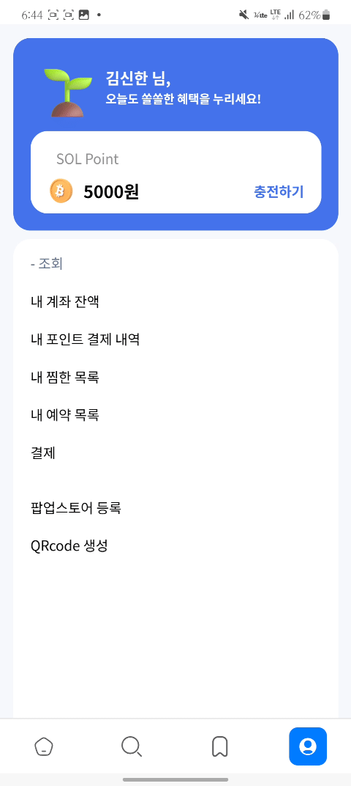
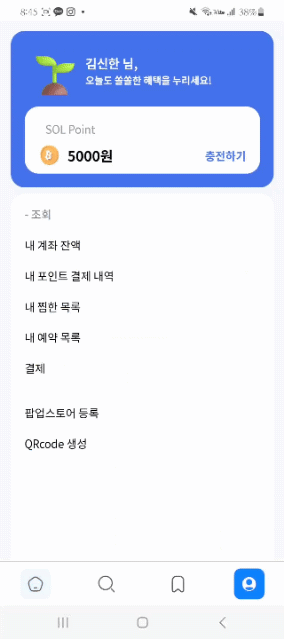
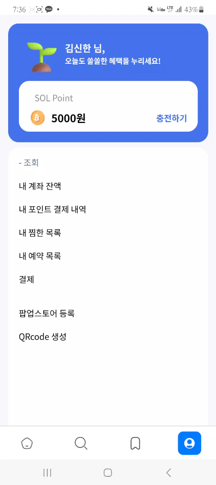

# 쏠쏠한 팝업 (SOL-POP)

"쏠쏠한 팝업(SOL-POP)"은 20대와 30대 고객과의 소통을 확대하여 미래의 고객 가치를 높이는 것을 목표로 하는 팝업 스토어 플랫폼입니다. 이 플랫폼을 통해 사용자는 관심 있는 팝업 스토어 정보를 쉽게 조회하고, 선호하는 시간에 우선 예약할 수 있습니다. 또한, 신한은행과 연계된 현장 결제 할인, 래플 응모 이벤트 등 다양한 혜택을 누릴 수 있습니다.

뿐만 아니라, 쏠팝은 기업의 팝업 스토어 홍보를 돕는 플랫폼으로, 해당 팝업 스토어를 고객들에게 효과적으로 홍보할 수 있습니다. 기업은 이를 통해 수집된 고객 데이터 통계를 분석하여 보다 효과적인 마케팅 전략을 수립할 수 있습니다. 이와 같은 쏠팝 플랫폼을 통해 신한 그룹이 추구하는 ‘고객’, ‘신한’, 그리고 ‘사회’가 함께 성장하는 **선순환 구조**를 구축합니다.

 

## 서비스 시연

| 메인페이지                                                                                                            | 회원가입                                                                                                           | 로그인                                                                                                      | 인기 팝업 리스트                                                                                          |
| --------------------------------------------------------------------------------------------------------------------- | ------------------------------------------------------------------------------------------------------------------ | ----------------------------------------------------------------------------------------------------------- | --------------------------------------------------------------------------------------------------------- |
|                                                                            |                                                                           |                                                                      |                                                            |
| 쏠쏠한 팝업은 앱으로 설치하여 이용하실 수 있습니다.콘텐츠를 확인하고 인기있는 팝업스토어를 미리 확인해볼 수 있습니다. | 회원가입 화면에서는 사용자가 새로운 계정을 만들 수 있습니다. 계정 생성시 이벤트로 계좌에 10000원을 입금해드립니다. | 로그인 화면에서는 사용자가 기존 계정으로 로그인할 수 있습니다. 로그인을 완료하시면 메인페이지로 이동합니다. | 인기 있는 콘텐츠의 팝업 리스트를 확인할 수 있습니다. 가장 상단에는 광고를 의뢰한 팝업스토어가 위치합니다. |

| 캘린더                                                       | 검색                                                | 쏠앱으로 이동                                        | 상세페이지                                                   |
| ------------------------------------------------------------ | --------------------------------------------------- | ---------------------------------------------------- | ------------------------------------------------------------ |
|                       |                |         |                   |
| 원하는 날짜에 진행되는 팝업스토어 목록을 확인할 수 있습니다. | 사용자가 팝업스토어 및 이벤트를 검색할 수 있습니다. | 쏠쏠한 팝업에서도 신한 SOL뱅크로 이동할 수 있습니다. | 팝업스토어의 정보, 위치 등의 상세 정보를 확인할 수 있습니다. |

| 찜하기 및 찜한 목록                                              | 예약                                                   | 래플 응모                                                                         | 계좌 잔액 조회 및 포인트 충전                                                     |
| ---------------------------------------------------------------- | ------------------------------------------------------ | --------------------------------------------------------------------------------- | --------------------------------------------------------------------------------- |
|                 |                   |                                          |                          |
| 사용자가 관심 있는 항목을 찜하고 찜한 목록을 관리할 수 있습니다. | 원하는 날짜와 시간에 팝업스토어 예약을 할 수 있습니다. | 팝업스토어에 방문한 후 발급받은 응모번호를 통해 래플 이벤트에 응모할 수 있습니다. | 사용자가 자신의 계좌 잔액을 확인하고, 그 금액을 통해 포인트를 충전할 수 있습니다. |

| 포인트 내역                                     | 결제하기                                                             | 스토어 정보 등록                                                 | 결제 QR 생성                                                     |
| ----------------------------------------------- | -------------------------------------------------------------------- | ---------------------------------------------------------------- | ---------------------------------------------------------------- |
|      |                             |                   |                       |
| 사용자가 포인트 사용 내역을 확인할 수 있습니다. | 포인트를 사용하여 현장에서 QR 코드를 통해 결제를 진행할 수 있습니다. | 기업에서 팝업스토어의 정보를 입력하고 홍보를 의뢰할 수 있습니다. | 기업에서 입력한 금액에 맞는 결제용 QR 코드를 생성할 수 있습니다. |

## 목차

#### &emsp; [➤ 1. 기획 배경](#-기획-배경) 

#### &emsp; [➤ 2. 주요 기능](#-주요-기능) 

#### &emsp; [➤ 3. 기대 효과](#-기대-효과) 

#### &emsp; [➤ 4. 확장성](#-확장성) 

#### &emsp; [➤ 5. 프로젝트 기간](#-프로젝트-기간) 

#### &emsp; [➤ 6. 팀 소개](#-팀-소개) 

#### &emsp; [➤ 7. 개발 환경](#-개발-환경) 

#### &emsp; [➤ 8. 실행 방법](#-실행-방법) 

 

## 📘 기획 배경

#### 새로운 고객 유치를 위한 팝업스토어 플랫폼

현대 사회에서 MZ 세대는 소비 트렌드를 주도하는 중요한 고객층으로 자리 잡고 있습니다. 이들은 자신만의 라이프스타일을 중시하며, 새로운 경험을 추구하는 경향이 강합니다. 특히, 기존의 생활필수품이나 저축 중심의 소비에서 벗어나, 콘서트나 팝업 스토어와 같은 문화적 경험에 대한 관심이 높아지고 있습니다. 이러한 트렌드에 따라 팝업 스토어는 MZ 세대에게 매력적인 공간으로 부상하고 있으며, 다양한 브랜드와 테마를 경험할 수 있는 기회를 제공합니다.

이러한 배경에서 저희는 MZ 세대 고객의 관심을 끌고, 동시에 팝업 스토어를 홍보하려는 기업들까지 사로잡을 수 있는 플랫폼을 기획했습니다. 이 애플리케이션을 통해 MZ 세대 고객을 유치하고, 기업들에게는 효과적인 마케팅 도구를 제공하는 것을 기획했습니다.

 

## 🔍 주요 기능

#### 1. 팝업 스토어 정보 실시간 조회

사용자의 관심 분야 및 일정에 맞게 필터링된 팝업 스토어 리스트를 제공합니다.

#### 2. 팝업 스토어 우선 예약 서비스

사용자가 원하는 날짜와 시간에 맞춰 현장에서 오랜 기다림을 하지 않고도 팝업 스토어를 예약할 수 있습니다.

#### 3. 래플 응모 및 현장 결제 할인

쏠팝을 사용하여 팝업스토어를 방문한 사용자들은 신한은행과 연계된 팝업스토어 래플에 응모하거나 현장 결제 할인 혜택을 받을 수 있습니다.

#### 4. 기업의 팝업스토어 홍보 및 마케팅 전략 수립

연계된 기업들은 앱을 통해 자사의 팝업 스토어를 효과적으로 홍보할 수 있습니다.
또한 예약 기능을 통해 수집된 고객 데이터를 제공받을 수 있습니다. 이를 활용해 고객을 위한 마케팅 전략 수립에 이용할 수 있습니다.

 

## 🔔 기대 효과

#### 1. 신규 고객 유치

MZ 세대 맞춤 새로운 경험을 제공함으로써 신규 고객을 유치함과 동시에 젊은 세대와의 브랜드 커뮤니케이션 활성화에 기여할 것으로 기대됩니다.

#### 2. 상생의 선순환 구조

쏠팝을 통해 신한은행과 스타트업 간 매칭 플랫폼으로 확장될 수 있습니다. 신규 및 소규모 기업에 대한 투자 및 함께 운영하는 팝업 스토어를 통해 신한 그룹이 추구하는 ‘고객’과 ‘신한’, 그리고 ‘사회’가 상생하는 선순환 구조를 구축합니다. 이를 기반으로 ESG 경영의 일환인 스타트업 육성이 가능할 것으로 기대됩니다.

#### 3. 비즈니스 모델 구축

스타트업 및 벤처기업의 경우 자신들의 상품을 홍보하기 위해 팝업 스토어를 진행합니다.
기업의 팝업 스토어 홍보를 의뢰 받고, 쏠팝에서 해당 팝업 스토어를 고객들에게 홍보할 수 있습니다.
나아가, 고객들이 해당 기업 팝업 스토어에 참여했을 때 래플 응모, 현장 결제 할인, 포인트 적립 등을 통해 기업, 쏠팝, 고객 모두 베네핏을 가질 수 있습니다.

 

## 🔋 확장성

#### 1. 팝업스토어 대여 공간 제공

신한은행의 건물 내에 U+의 일상비일상의 틈과 같은 팝업스토어 대여 공간을 마련하여, 고객의 관심을 유도할 수 있습니다. 이를 통해 신한은행은 MZ 세대와의 접점을 확대하고, 새로운 경험을 제공함으로써 브랜드 이미지를 강화할 수 있습니다.

#### 2. 수익 공유 기반의 공간 대여

팝업스토어 대여 공간의 대여비를 고정적으로 받는 대신, 더 현대와 같이 팝업스토어를 통해 얻은 매출액과 수익의 일정 비율을 수수료로 받는 형태로 운영할 수 있습니다. 이는 팝업스토어 운영 기업에게 초기 비용 부담을 줄여주고, 신한은행은 보다 안정적인 수익을 기대할 수 있습니다.

#### 3. 단기 대출 서비스 제공

현재 인기 상권에서 팝업스토어 공간 대여 비용이 수천만 원에 이를 수 있습니다. 이러한 상황에서 팝업스토어 운영 기업을 대상으로 단기 대출 서비스를 제공하여 자금 조달을 지원할 수 있습니다. 이는 팝업스토어 활성화와 더불어 신한은행의 금융 서비스 확장에도 기여할 것입니다.

 

## 📆 프로젝트 기간

### 2024.08.14 ~ 2024.08.31 (2주)

 

## 👪 팀 소개

<table>
  <thead>
    <tr>
      <th style="text-align: center;">정우영</th>
      <th style="text-align: center;">박건국</th>
      <th style="text-align: center;">정하림</th>
      <th style="text-align: center;">지민경</th>
      <th style="text-align: center;">황민채</th>
    </tr>
  </thead>
  <tbody>
    <tr>
      <td style="text-align: center;">Leader / BE</td>
      <td style="text-align: center;">FE</td>
      <td style="text-align: center;">BE</td>
      <td style="text-align: center;">FE</td>
      <td style="text-align: center;">FE</td>
    </tr>
  </tbody>
</table>
 

## 🔨 개발 환경

### 시스템 아키텍처

### ERD

### 사용 기술

---

<h3>Frontend</h3>

<h3>Backend</h3>

<h3>DB</h3>

<h3>Infra</h3>

 

 

---

### 커밋 컨벤션

---

- feat : 새로운 기능 추가
- fix : 버그 수정
- hotfix : 급하게 치명적인 버그 수정
- docs : 문서 수정
- style : 코드 포맷팅, 세미콜론 등의 스타일 수정(코드 자체 수정 X)
- refactor : 프로덕션 코드 리팩토링
- test : 테스트 코드, 테스트 코드 리팩토링
- chore : 빌드 과정 또는 보조 기능(문서 생성 기능 등) 수정
- rename : 파일 혹은 폴더명을 수정하거나 옮기는 작업만인 경우
- remove : 파일을 삭제하는 작업만 수행한 경우
- comment : 필요한 주석 추가 및 변경

## 🚀 실행 가이드 라인

### 1. https://solpop.xyz/login 에 접속한다.

### 2. chungxl21@gmail.com, souffle1903을 입력하고 로그인하기를 누른다.

### 3. 메인페이지로 이동한 뒤 아래 기능을 이용해본다.

#### 1. 인기 팝업스토어 조회 및 예약

#### 2. 일정 별 팝업 스토어 조회 및 예약

#### 3. 방문한 팝업 스토어의 래플 응모

#### 4. 신한 SOL 어플 이동

#### 5. 카테고리별 팝업 스토어 검색

### 4. 하단 바에 돋보기를 눌러 아래 기능을 이용해본다.

#### 1. 다양한 키워드를 넣어 팝업스토어를 검색

#### 2. 팝업 스토어의 정보 확인, 예약 하기, 위치 제공

#### 3. 팝업 스토어를 클릭 후 하트를 눌러 찜하기

### 5. 하단 바에 책갈피를 눌러 찜한 팝업 스토어 정보 확인해본다.

### 6. 하단 바에 사용자를 눌러 아래 기능을 이용해본다.

#### 1. 계좌 잔액을 보고 적절한 포인트를 충전

#### 2. 포인트 결제 내역 확인

#### 3. 내 찜한 목록 -> 팝업 스토어 목록 확인

#### 4. (이 부분은 심사 때 진행 할 예정입니다. 눈으로만 봐주시면 감사하겠습니다.) 내 예약 목록 -> 예약 팝업 스토어 직원 확인 후 응모 번호 수령 -> 래플 응모하기

#### 5. 예약 목록에서 방문 전, 방문 완료 확인하기
